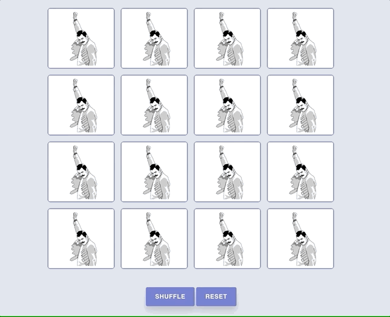

# fuzzy-memory



## Description
Assignment from [Yrgo](https://github.com/yrgo): Create a memory game using JavaScript.


## Installation

Use the terminal to clone project.

```bash
git clone https://github.com/xhika/Fuzzy-Memory.git
```


## License
[MIT](https://choosealicense.com/licenses/mit/)
